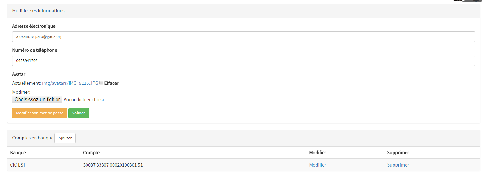
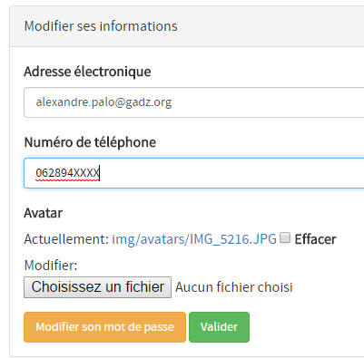
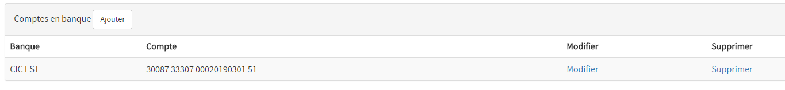
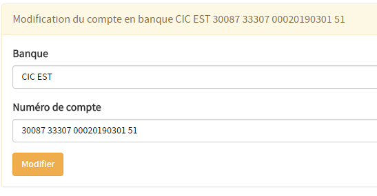

# Modifier ses informations personnelles

## Accès à la page de modification des informations
La page de modification de ses informations personnelles est accessible de partout sur Borgia. Il suffit de cliquer sur le petit crayon en haut à droite d'une page.

## Page de modification des informations personnelles

La page de modification contient deux encarts. Le premier permet de modifier les informations courantes, et le second de gérer ses comptes en banque.

### Informations courantes

Il est possible de modifier de façon simple et rapide les informations suivantes :
  - Son adresse mail,
  - Son numéro de téléphone,
  - Son avatar (affiché en haut à droite).

Ces informations sont disponibles pour le président ou le trésorier par exemple. Ainsi il pourra vous contacter rapidement sans problème (si vous n'êtes pas de la même prom'ss par exemple).

De plus, l'adresse mail permet de récupérer un lien dans le cas de la réinitialisation du mot de passe.

> Note : privilégiez des images "carrées" pour les avatars. L'affichage sera meilleur. Un petit tour sur Paint permet de modifier les dimensions de n'importe quelle image.

### Comptes en banque

Les comptes en banque permettent de même à un trésorier de vous faire un virement de manière simple, sans vous le demander. Il n'est pas obligatoire de renseigner un compte en banque.

Pour ajouter un compte, cliquez sur "Ajouter".

Il est possible à tout moment de modifier ou de supprimer un compte, via les boutons dans la liste.

#### Changement du mot de passe

Pour modifier son mot de passe, cliquez sur le bouton orange "Modifier son mot de passe". La page suivante permet de le modifier, en connaissant l'ancien.
Si vous ne le connaissez pas, il faudra passer par la page de réinitialisation de mot de passe dont le lien est disponible sur la page de connexion.

