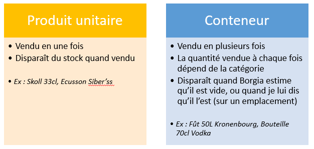

# Introduction sur la gestion des produits par Borgia

## Introduction

Borgia gère les produits d'une manière spécifique afin de pouvoir concerner le maximum de magasins différents en utilisant la même base de données. Ainsi si la gestion ne semble au début pas optimale pour certains magasins, il est toujours possible de s'adapter en détourner un peu le système. Néamoins, la gestion actuelle permet de couvrir l'énorme majorité des produits vendus aux magasins de l'association.

Le cas de l'auberge (et des magasins identiques) est spécifique et fait l'objet d'un autre guide.

## Deux types de produits
Borgia utilise deux types de produits. Vous devez faire de même lors de la gestion d'un magasin sinon vous n'aurez pas les résultats attendus ! Déterminer le type du produit que l'on veut vendre est simple : une seule question à se poser.

### Déterminer le type de produit

Afin de déterminer le type de produit que l'on veut vendre, il faut se poser la question suivante concernant le produit que l'on vient d'acheter :
> Est-ce que je veux vendre mon produit en une fois ou en plusieurs ?

Si la réponse est "en une fois", vous avez à faire à un "produit unitaire". Si la réponse est plutôt "en plusieurs fois", c'est un "conteneur" !

Attention, je précise bien que cette question doit se poser sur le produit qui est acheté, par exemple à Metro ou chez un fournisseur. Par exemple je dois me poser la question en regardant mon fût de bière en entier.

#### Produit unitaire

> Exemples : Skoll 33cl, Grise T38, Une bouteille de Lambrusco, Ecusson Siber'ss, ...

Un produit unitaire est toujours vendu en une fois. Ainsi si un membre de l'association l'achète, il est considéré comme vendu et disparaîtera du stock.

Par exemple, lorsque j'achète une Skoll 33cl, j'achète la numéro 101. La numéro 101 devient vendue et plus personne ne peux l'acheter.

#### Conteneur

> Exemples : Fût 50L Kronenbourg, Bouteille 70cl Vodka, Bouteille 75cl soda, ...

Les conteneurs ont un comportement différent des produits unitaires. Ils sont vendus petits à petits. L'exemple le plus simple est bien sûr un fût, mais c'est aussi le cas des bouteilles d'alcools fort ou de soft par exemple.

Lorsque qu'un membre de l'association achète produit issu d'un conteneur, il n'achète pas le conteneur mais qu'une petite partie. La quantité qu'il achète est définie par le type de conteneur :

  - Fût, soft: 25 unités de base
  - Alcool fort, sirop: 4 unités de base
  - Viande, fromage, accompagnement, alimentaire: 1 unité de base

Du coup, l'achat d'un produit du conteneur "Fût 50L Kronembourg" déclenche l'achat de 25cl de bière. Le fût est diminué de 25cl. Mais il lui reste encore 4950cl ;).

Le conteneur ne va donc pas disparaître tout de suite, mais seulement lorsqu'il sera vidé entièrement. Si le conteneur est positionné sur un "emplacement de vente", il ne disparaîtera que si vous l'enlevez et que vous sélectionnez "Le conteneur été vide". S'il n'est pas à un emplacement, il disparaîtera lorsque Borgia estimera qu'il est vide.

### Synthèse

Deux types de produits existent pour Borgia: les produits unitaires et les conteneurs.

Afin de déterminer le type de produit, il faut, en regardant le produit que l'on vient d'acheter, se demande si on veut ou non vendre le produit en une fois. Si oui c'est un produit unitaire, sinon c'est un conteneur.

L'ajout d'un nouveau produit n'est pas fait de la même façon dans le cas d'un produit unitaire et d'un conteneur. Cependant l'ajout de produits au stock après un achat est fait de la même façon :).

## Ajouter un nouveau produit

## Ajouter des produits en stock après un achat

## Gérer un produit

### Prix de vente

### Gestion du stock
